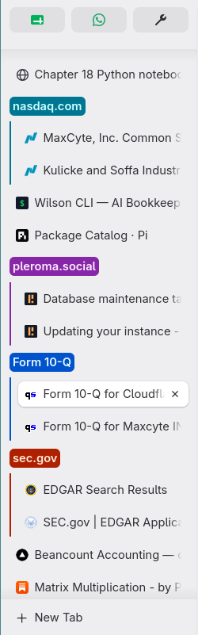
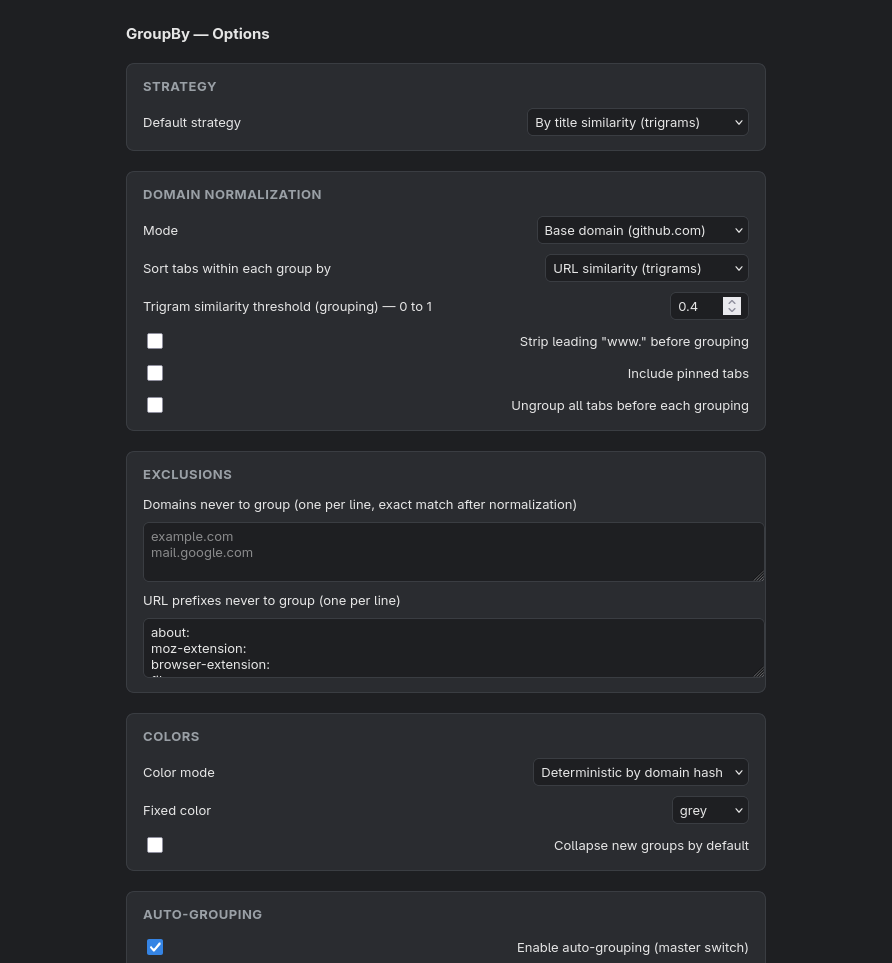

<p align="center">
  
</p>

<h1 align="center">GroupBy — Firefox tab grouper</h1>

<p align="center">
  <a href="https://addons.mozilla.org/en-US/firefox/addon/groupby-tab-grouper/">
    
  </a>
</p>

GroupBy tidies up a cluttered tab bar by gathering your open tabs from the
same website into neat, color-coded, labeled groups — so you can find what you
need at a glance. **Most users should [install it from Firefox Add-ons]
(https://addons.mozilla.org/en-US/firefox/addon/groupby-tab-grouper/)** —
just click “Add to Firefox” and you’re done, no building required.

The rest of this README is for contributors and tinkerers who want to run the
source, modify it, or add new grouping strategies. Under the hood, GroupBy is a
Manifest V3 Firefox extension built around a pluggable **grouping strategy**
interface so richer semantic strategies (topic, project, intent, LLM
classification) can be added later without touching the rest of the system. It
uses Firefox's native tab grouping APIs — `browser.tabs.group()` and
`browser.tabGroups.*` — rather than simulating groups in custom UI.

## What it does

- Groups the tabs of the current window by normalized domain
  (`docs.github.com` and `github.com` collapse under `github.com` by default,
  or stay separate in `hostname` mode).
- Manual grouping from the toolbar popup.
- Optional auto-grouping on tab create / update / move / window focus change,
  debounced to avoid reshuffling during active browsing.
- Deterministic per-domain color via FNV-1a hash, or a fixed single color.
- Skips pinned tabs (configurable), `about:` pages, internal/extension pages,
  and custom exclusions.
- Non-destructive: it never ungroups or moves tabs the active strategy did not
  speak to, and it skips no-op re-applies via a plan hash.

## Screenshots

<p align="center">
  
  
</p>

*Left: the toolbar popup — group/ungroup actions, grouping strategy, normalization,
within-group sort, trigram threshold, and toggles. Right: the options page —
full configuration including exclusions, color mode, and auto-grouping event hooks.*

## Minimum Firefox version

**Firefox 142+** — `tabs.group()` shipped in Firefox 138 and the `tabGroups`
*permission* in 139, but Mozilla's required `data_collection_permissions`
field is only recognized from Firefox 140 (desktop) / 142 (Android). The
`browser_specific_settings.gecko` field enforces this at install time.

## Project structure

```text
.
├── manifest.json              # MV3 manifest, Firefox-first
├── build.mjs                  # esbuild bundler (TS -> dist/)
├── tsconfig.json
├── package.json
├── src/
│   ├── background/
│   │   ├── main.ts            # entry point, runtime messaging, bootstrap
│   │   └── events.ts          # GroupingController + auto-group listeners
│   ├── popup/
│   │   ├── popup.html
│   │   └── popup.ts
│   ├── options/
│   │   ├── options.html
│   │   └── options.ts
│   ├── shared/
│   │   └── styles.css
│   ├── core/
│   │   ├── types.ts           # Settings, BrowserTab, CandidateTab, GroupPlan, strategy interface
│   │   ├── browser-env.ts     # native browser shim (resolved at bundle time)
│   │   ├── storage.ts         # versioned settings persistence + migration
│   │   ├── planner.ts         # pure planning: tabs -> GroupPlan[]
│   │   └── applier.ts         # safe application: GroupPlan[] -> Firefox groups
│   ├── strategies/
│   │   ├── grouping-strategy.ts  # registry
│   │   └── domain-grouping.ts    # DomainGroupingStrategy (reference impl)
│   ├── util/
│   │   ├── domain.ts          # URL/hostname/registrable-domain helpers (pure)
│   │   ├── color.ts           # deterministic color hashing
│   │   ├── firefox-api.ts     # FirefoxApplierApi (Firefox adapter)
│   │   ├── debounce.ts
│   │   └── log.ts
│   └── types/shims.d.ts
└── tests/                     # vitest unit + mocked-API tests
    ├── domain.test.ts
    ├── color.test.ts
    ├── debounce.test.ts
    ├── planner.test.ts
    └── applier.test.ts
```

### Architecture in one paragraph

Planning is **pure** and synchronous-ish: `planner.ts` filters raw browser
tabs into `CandidateTab`s (enriched with hostname / registrable domain) and
asks the active strategy to bucket them into `GroupPlan[]`. Mutation lives
only in `applier.ts`, which talks to Firefox through the `ApplierApi`
interface (`FirefoxApplierApi` in production, an in-memory fake in tests).
The background `GroupingController` is the only thing that schedules applies,
debounces event-driven triggers, and guards against re-entrancy and no-ops.
UI pages talk to the background over `runtime.sendMessage`.

## Build

```bash
npm install
npm run build        # one-shot; writes dist/
npm run watch        # rebuild on change during development
npm test             # run vitest unit tests
npm run typecheck    # tsc --noEmit
```

## Run in Firefox via `about:debugging` (developers only)

> If you just want to **use** GroupBy, [install it from Firefox Add-ons]
(https://addons.mozilla.org/en-US/firefox/addon/groupby-tab-grouper/)
instead — no build steps required. The instructions below are for running the
> source yourself during development.

1. `npm install && npm run build`.
2. Open Firefox 142+ and navigate to `about:debugging#/runtime/this-firefox`.
3. Click **"Load Temporary Add-on…"**.
4. Select **`dist/manifest.json`** in this project.
5. The GroupBy button appears in the toolbar. Click it to open the popup.
   Use the options page (linked from the popup, or via the Add-ons manager) to
   change strategy settings and auto-grouping behavior.

> Temporary add-ons are removed when Firefox closes. To install permanently,
> sign the extension via [Mozilla's signing pipeline](https://addons.mozilla.org/developers/)
> and load the signed `.xpi`, or load it into a [Development Edition /
   Unbranded build](https://support.mozilla.org/kb/add-on-signing-in-firefox)
   with `xpinstall.signatures.required=false`.

## Debugging

- Background script: `about:debugging` → "Inspect" next to GroupBy. Logs are
  prefixed `[groupby]`.
- Popup: right-click the toolbar button → "Inspect Popup".
- Options page: open via the Add-ons manager, then use the standard DevTools.

## Permissions rationale

| Permission   | Why                                                                                  |
| ------------ | ------------------------------------------------------------------------------------ |
| `tabs`       | Needed to read tab `url`/`title` and to call `tabs.group()` / `tabs.query()`.        |
| `tabGroups`  | Required by MDN for the `tabGroups` API (`query`, `update`).                         |
| `storage`    | Persisting versioned settings via `storage.local`.                                   |

No host permissions are requested — the extension never reads page content.

## Known limitations of the tab-grouping APIs

- Firefox does **not** expose `tabs.ungroup()`. To leave a group, a tab has to
  be grouped elsewhere or moved out by the user. This extension therefore
  never attempts to ungroup — it only creates/reuses groups for the plans the
  active strategy returns.
- All tabs in a Firefox tab group must be adjacent. `tabs.group()` moves tabs
  as needed; expect `onMoved` events to fire as a result (the applier's hash
  guard turns the resulting follow-up apply into a no-op).
- `tabGroups.update()` accepts `name`, `color`, `collapsed`. Color must be one
  of the eight Firefox color names; invalid values fall back to `grey`.

## Manual QA checklist

- [ ] Load via `about:debugging`, button appears.
- [ ] Open ≥2 tabs on the same domain → click "Group tabs now" → a group is
      created with the right title and color.
- [ ] `docs.github.com` + `github.com` collapse under one group in
      `registrableDomain` mode; split in `hostname` mode.
- [ ] Pinned tabs are not grouped unless "Include pinned tabs" is on.
- [ ] `about:` pages never get grouped.
- [ ] Toggling auto-grouping on with "On tab created" groups new tabs after
      the debounce window, without runaway reshuffling.
- [ ] Options page exclusions are honored after Save.
- [ ] Reloading the extension preserves settings (storage.local).

## How to add semantic grouping later

The whole system is built around `GroupingStrategy`:

```ts
interface GroupingStrategy {
  readonly id: string;
  readonly label: string;
  buildGroups(tabs: CandidateTab[], settings: Settings): Promise<GroupPlan[]> | GroupPlan[];
}
```

To add a new strategy:

1. Create `src/strategies/my-strategy.ts` exporting a class implementing
   `GroupingStrategy`. Its `buildGroups` may use `tab.title`, `tab.url`,
   `tab.hostname`, `tab.registrableDomain`, or any future field you add to
   `CandidateTab` (e.g. content-derived metadata).
2. Register it in `src/core/planner.ts`'s `ensureStrategiesRegistered()`:

   ```ts
   registerStrategy(new MyStrategy());
   ```

3. If your strategy needs extra configuration, extend `Settings` (bump
   `schemaVersion` and add a migration branch in `storage.ts`'s
   `migrateSettings`) and add UI controls to `options.html` / `options.ts`.
4. The popup and options "strategy" dropdown will pick it up automatically
   from the registry — no other wiring needed.

Because `buildGroups` is pure and returns plain `GroupPlan[]`, you can unit
test a new strategy exactly like `DomainGroupingStrategy` is tested in
`tests/planner.test.ts`. Heavy strategies (e.g. an LLM-backed one) can be
`async` and pull in content/opener metadata without changing the planner or
applier.
